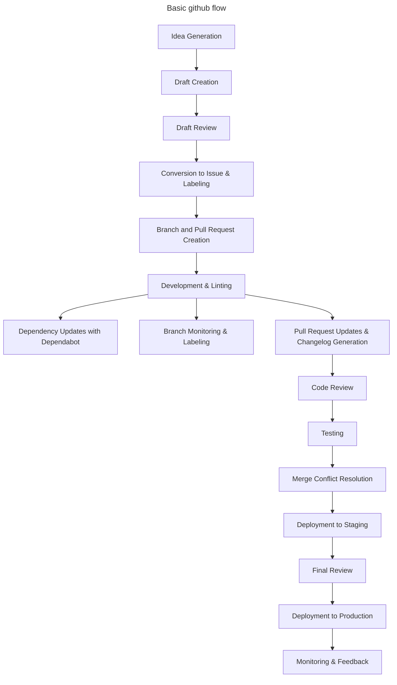

    Idea Generation:
        A team member has an idea or identifies a need.
        Preliminary discussions may occur informally or in designated brainstorming sessions.
        The idea might be documented in a shared space, like a wiki or a notepad.

    Draft Creation:
        The idea is formally documented as a draft in a dedicated platform (e.g., GitHub).
        The draft includes a brief description, potential benefits, initial thoughts on implementation, and any potential challenges.
        Team members can comment on the draft, providing feedback or asking questions.

    Draft Review:
        The draft undergoes a review process, which might involve team discussions, stakeholder input, or feasibility checks.
        Feedback from the review is incorporated into the draft.

    Conversion to Issue & Labeling:
        Once the draft is sufficiently detailed and has garnered enough support, it's converted into a GitHub issue.
        The issue contains a detailed description, acceptance criteria, and any relevant attachments or links.
        An automation (e.g., using GitHub Actions or a bot) automatically labels the new issue as "Ready".

    Branch and Pull Request Creation:
        A new branch is automatically created using GitHub Actions (or manually) when the issue is opened.
        Simultaneously, a draft Pull Request (PR) is opened against the main branch to track the progress of the feature. The PR is marked as a "Work in Progress" (WIP) or "Draft".
        The branch follows a naming convention, e.g., issue-123-feature-description.

    Development & Linting:
        Developers check out the new branch and begin implementing the feature or fix.
        On each commit to any branch, an automated GitHub Action (or equivalent CI tool) lints the code to ensure it adheres to coding standards.
        Regular commits are made, ideally every 5-10 minutes or after small logical changes.
        These commits are reflected in the draft PR, allowing for tracking of the feature's development duration.

    Dependency Updates with Dependabot:
        Dependabot periodically checks for outdated dependencies in the project.
        When an outdated dependency is identified, Dependabot automatically creates a PR with the updated dependency.
        This PR undergoes the standard review process.

    Branch Monitoring & Labeling:
        An automated process (e.g., a GitHub Action or bot) periodically checks the state of all feature branches.
        If a branch is found to be 30 commits (or any other defined threshold) behind its target branch (e.g., main), it's automatically labeled as "Stale" or "Needs Rebase".
        Developers are notified (either through the platform or via email) that their branch needs attention.

    Pull Request Updates & Changelog Generation:
        Periodically, an automated process compiles all the commits into a summary message and comments on the PR with this summary.
        Tools or scripts (e.g., standard-version or auto-changelog) automatically update the changelog based on commit messages or PR titles.
        Once the feature or fix is ready for review, the draft status of the PR is removed, signaling it's ready for review.

    Code Review:
        Other developers review the PR. This can be peers or a dedicated review team.
        Feedback is provided, and any necessary changes are made to the PR.
        The PR is updated with new commits or by rebasing and squashing commits for clarity.

    Testing:
        Automated tests are run against the PR using a CI/CD pipeline.
        Depending on the setup, manual testing might be conducted in a staging environment.
        Any bugs or issues identified are fixed, and the PR is updated.

    Merge Conflict Resolution:
        If there are conflicts between the PR and the main branch, they are resolved by the developer.
        This often involves rebasing the feature branch against the main branch and manually resolving conflicts.

    Deployment to Staging:
        The feature is deployed to a staging environment.
        Further testing, including user acceptance testing (UAT), might be conducted.
        Stakeholders or product owners review the feature in the staging environment.

    Final Review:
        Any final feedback from the staging environment is addressed.
        The feature undergoes a final review, ensuring all acceptance criteria are met and all tests pass.

    Deployment to Production:
        The PR is merged into the main branch.
        The feature is deployed to the production environment using a CD pipeline.
        Post-deployment checks are conducted to ensure everything is running smoothly.

    Monitoring & Feedback:
        The feature is monitored in the production environment.
        Feedback is collected from end-users and stakeholders.
        Any issues or bugs identified post-deployment are addressed in subsequent patches or updates.
