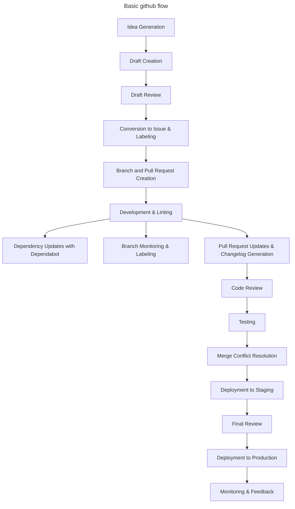

    Idea Generation:
        A team member has an idea or identifies a need.
        Preliminary discussions may occur informally or in designated brainstorming sessions.
        The idea might be documented in a shared space, like a wiki or a notepad.

    Draft Creation:
        The idea is formally documented as a draft in a dedicated platform (e.g., GitHub).
        The draft includes a brief description, potential benefits, initial thoughts on implementation, and any potential challenges.
        Team members can comment on the draft, providing feedback or asking questions.

    Draft Review:
        The draft undergoes a review process, which might involve team discussions, stakeholder input, or feasibility checks.
        Feedback from the review is incorporated into the draft.

    Conversion to Issue & Labeling:
        Once the draft is sufficiently detailed and has garnered enough support, it's converted into a GitHub issue.
        The issue contains a detailed description, acceptance criteria, and any relevant attachments or links.
        An automation (e.g., using GitHub Actions or a bot) automatically labels the new issue as "Ready".

    Branch and Pull Request Creation:
        A new branch is automatically created using GitHub Actions (or manually) when the issue is opened.
        Simultaneously, a draft Pull Request (PR) is opened against the main branch to track the progress of the feature. The PR is marked as a "Work in Progress" (WIP) or "Draft".
        The branch follows a naming convention, e.g., issue-123-feature-description.

    Development & Linting:
        Developers check out the new branch and begin implementing the feature or fix.
        On each commit to any branch, an automated GitHub Action (or equivalent CI tool) lints the code to ensure it adheres to coding standards.
        Regular commits are made, ideally every 5-10 minutes or after small logical changes.
        These commits are reflected in the draft PR, allowing for tracking of the feature's development duration.

    Dependency Updates with Dependabot:
        Dependabot periodically checks for outdated dependencies in the project.
        When an outdated dependency is identified, Dependabot automatically creates a PR with the updated dependency.
        This PR undergoes the standard review process.

    Branch Monitoring & Labeling:
        An automated process (e.g., a GitHub Action or bot) periodically checks the state of all feature branches.
        If a branch is found to be 30 commits (or any other defined threshold) behind its target branch (e.g., main), it's automatically labeled as "Stale" or "Needs Rebase".
        Developers are notified (either through the platform or via email) that their branch needs attention.

    Pull Request Updates & Changelog Generation:
        Periodically, an automated process compiles all the commits into a summary message and comments on the PR with this summary.
        Tools or scripts (e.g., standard-version or auto-changelog) automatically update the changelog based on commit messages or PR titles.
        Once the feature or fix is ready for review, the draft status of the PR is removed, signaling it's ready for review.

    Code Review:
        Other developers review the PR. This can be peers or a dedicated review team.
        Feedback is provided, and any necessary changes are made to the PR.
        The PR is updated with new commits or by rebasing and squashing commits for clarity.

    Testing:
        Automated tests are run against the PR using a CI/CD pipeline.
        Depending on the setup, manual testing might be conducted in a staging environment.
        Any bugs or issues identified are fixed, and the PR is updated.

    Merge Conflict Resolution:
        If there are conflicts between the PR and the main branch, they are resolved by the developer.
        This often involves rebasing the feature branch against the main branch and manually resolving conflicts.

    Deployment to Staging:
        The feature is deployed to a staging environment.
        Further testing, including user acceptance testing (UAT), might be conducted.
        Stakeholders or product owners review the feature in the staging environment.

    Final Review:
        Any final feedback from the staging environment is addressed.
        The feature undergoes a final review, ensuring all acceptance criteria are met and all tests pass.

    Deployment to Production:
        The PR is merged into the main branch.
        The feature is deployed to the production environment using a CD pipeline.
        Post-deployment checks are conducted to ensure everything is running smoothly.

    Monitoring & Feedback:
        The feature is monitored in the production environment.
        Feedback is collected from end-users and stakeholders.
        Any issues or bugs identified post-deployment are addressed in subsequent patches or updates.

---

### 1. **Idea Drafting**:

- **What**:
  - Ideas for new features, enhancements, or fixes are initially drafted on a
    project board.
- **Why**:
  - **Visualization**: Project boards provide a visual representation of the
    development pipeline, making it easier to track progress.
  - **Collaboration**: Team members can discuss, prioritize, and refine ideas in
    a centralized location.

---

### 2. **Issue Creation**:

- **What**:
  - Once the idea is fully fleshed out, including design and other necessary
    details, it's converted into an issue.
- **Why**:
  - **Documentation**: Issues provide a detailed description of the task,
    ensuring everyone understands the requirements.
  - **Tracking**: Issues can be assigned, labeled, and tracked, ensuring
    accountability and progress monitoring.

---

### 3. **Branch Creation & Feature Branching**:

- **What**:
  - A new branch is created, linked to the issue. This ensures that the
    development work related to that issue is isolated from other tasks. Instead
    of developing directly on the main branch (often called `main` or `master`),
    every new feature, enhancement, or bugfix is developed on its own branch.
- **Why**:
  - **Isolation**: Separate branches allow for focused development without
    interference from other ongoing tasks.
  - **Traceability**: Linking branches to issues provides clear traceability of
    code changes to specific tasks.
  - **Stability**: The main branch remains stable and deployable at all times.
  - **Parallel Development**: Multiple features or fixes can be developed in
    parallel without interfering with each other.

---

### 4. **Pull Request Initiation**:

- **What**:
  - As soon as the branch is created, a pull request (PR) is opened. This PR
    will propose merging the new branch into a designated target branch
    (release, development, or staging). As soon as a PR is created or updated,
    tests are automatically run to ensure the new code doesn't introduce bugs.
- **Why**:
  - **Early Feedback**: Opening a PR early allows for continuous feedback during
    development.
  - **Integration**: It ensures that the new code will be integrated smoothly
    into the target branch once it's ready.
  - **Quality Assurance**: Ensure that new changes don't break existing
    functionality.
  - **Immediate Feedback**: Developers get immediate feedback if their changes
    pass or fail the tests.

---

### 5. **Automated Labeling - Ready to Code**:

- **What**:
  - An automated process adds a label "ready to code" to the issue, indicating
    to the developer that they can start working on the feature.
- **Why**:
  - **Status Indication**: Labels provide a quick visual indication of the
    status of an issue.
  - **Automation**: Reduces manual steps and ensures timely notifications.

---

### 6. **Developer Tagging for Review**:

- **What**:
  - Once the developer feels the feature or fix is ready for review, they
    manually add a tag to the PR to notify code reviewers.
- **Why**:
  - **Communication**: Ensures that code reviewers are aware that the PR is
    ready for their attention.
  - **Efficiency**: Streamlines the review process by clearly indicating when a
    PR is ready for review.

---

### 7. **Code Review**:

- **What**:
  - Before a PR is merged, it's reviewed by one or more team members.
- **Why**:
  - **Knowledge Sharing**: Team members become familiar with changes and reasons
    behind them.
  - **Mentoring**: Junior developers can learn from seniors through the review
    process.
  - **Error Detection**: More eyes on the code mean a higher chance of catching
    mistakes or areas of improvement.

---

### 8. **Merging & Continuous Integration**:

- **What**:
  - After the PR is reviewed and approved, it's merged into the main branch. The
    main branch is then automatically built and tested.
- **Why**:
  - **Up-to-date Main Branch**: The main branch always contains the latest
    approved changes.
  - **Ready for Deployment**: After passing all tests, the main branch remains
    in a state ready for deployment to production.

---

### 9. **Release Preparation**:

- **What**:
  - As the team approaches a release, a separate branch (often called a release
    branch) is created. This branch is dedicated to finalizing the release.
- **Why**:
  - **Focus**: The team can focus on final testing, bug fixes, and documentation
    updates without being disrupted by new features.
  - **Stability**: Ensures that the release is stable and thoroughly tested
    before it reaches users.

---

### 10. **Tagging and Release**:

- **What**:
  - Once the release is ready, the commit is tagged with a version number. A
    GitHub release is then created using this tag, and any relevant binaries,
    assets, or notes are attached.
- **Why**:
  - **Versioning**: Tags provide a clear version history, making it easy to
    track changes over time.
  - **Documentation**: Releases in GitHub allow for release notes, providing
    users with information about changes, fixes, and new features.

---

Following this comprehensive workflow ensures a structured approach from the
initial idea to the final release. It emphasizes clarity, traceability, and
collaboration, ensuring that tasks are well-defined and progress is transparent
to all team members.
