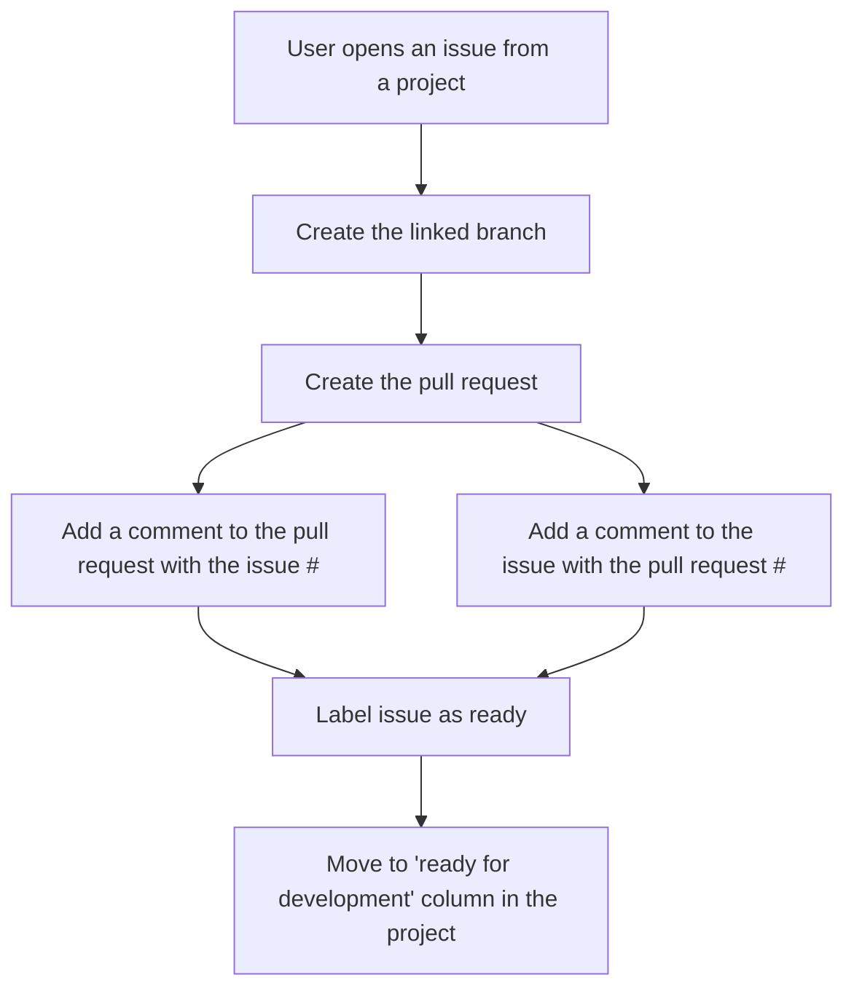

# To do

- [x] Label an issue
- [x] Create a new branch linked to the issue ticket
- [x] Create a pull request for the issue ticket
- [x] Link an issue and pull request together
  - [x] Add a comment to an issue with the pull #
  - [x] Add a comment to an pull request with the issue #
  - [ ] Actually link the tickets together
    - I haven't been able to find a way to link them together the same way a user can manually do it -- this is a work around
- [ ] check out https://docs.github.com/en/issues/managing-your-tasks-with-tasklists/about-tasklists
- [ ] check out milestones
- [x] ? create a workflow chart for a "draft issue" when it is converted to an issue

# Links

## GraphQL

<!-- Main pages -->
- https://docs.github.com/graphql
- https://docs.github.com/en/graphql/overview/explorer
- https://docs.github.com/en/graphql/reference

<!-- Random pages -->
- https://medium.com/swlh/introduction-to-graphql-with-github-api-64ee8bb11630
- https://docs.github.com/en/graphql/guides/forming-calls-with-graphql#working-with-variables

<!-- mutations -->
- https://docs.github.com/en/graphql/reference/mutations#createissue
- https://docs.github.com/en/graphql/reference/mutations#updateissue
- https://docs.github.com/en/graphql/reference/mutations#linkprojectv2torepository
- https://docs.github.com/en/graphql/reference/mutations#linkrepositorytoproject
- https://docs.github.com/en/graphql/reference/mutations#updateprojectv2
- https://docs.github.com/en/graphql/reference/mutations#addpullrequestreview

<!-- objects -->
- https://docs.github.com/en/graphql/reference/objects#issue
- https://docs.github.com/en/graphql/reference/objects#projectv2
- https://docs.github.com/en/graphql/reference/objects#projectv2item
- https://docs.github.com/en/graphql/reference/objects#pullrequest

<!-- interfaces -->
- https://docs.github.com/en/graphql/reference/interfaces#repositorynode

