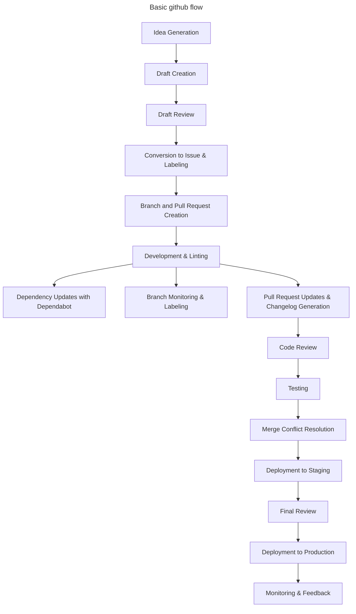

    Idea Generation:
        A team member has an idea or identifies a need.
        Preliminary discussions may occur informally or in designated brainstorming sessions.
        The idea might be documented in a shared space, like a wiki or a notepad.

    Draft Creation:
        The idea is formally documented as a draft in a dedicated platform (e.g., GitHub).
        The draft includes a brief description, potential benefits, initial thoughts on implementation, and any potential challenges.
        Team members can comment on the draft, providing feedback or asking questions.

    Draft Review:
        The draft undergoes a review process, which might involve team discussions, stakeholder input, or feasibility checks.
        Feedback from the review is incorporated into the draft.

    Conversion to Issue & Labeling:
        Once the draft is sufficiently detailed and has garnered enough support, it's converted into a GitHub issue.
        The issue contains a detailed description, acceptance criteria, and any relevant attachments or links.
        An automation (e.g., using GitHub Actions or a bot) automatically labels the new issue as "Ready".

    Branch and Pull Request Creation:
        A new branch is automatically created using GitHub Actions (or manually) when the issue is opened.
        Simultaneously, a draft Pull Request (PR) is opened against the main branch to track the progress of the feature. The PR is marked as a "Work in Progress" (WIP) or "Draft".
        The branch follows a naming convention, e.g., issue-123-feature-description.

    Development & Linting:
        Developers check out the new branch and begin implementing the feature or fix.
        On each commit to any branch, an automated GitHub Action (or equivalent CI tool) lints the code to ensure it adheres to coding standards.
        Regular commits are made, ideally every 5-10 minutes or after small logical changes.
        These commits are reflected in the draft PR, allowing for tracking of the feature's development duration.

    Dependency Updates with Dependabot:
        Dependabot periodically checks for outdated dependencies in the project.
        When an outdated dependency is identified, Dependabot automatically creates a PR with the updated dependency.
        This PR undergoes the standard review process.

    Branch Monitoring & Labeling:
        An automated process (e.g., a GitHub Action or bot) periodically checks the state of all feature branches.
        If a branch is found to be 30 commits (or any other defined threshold) behind its target branch (e.g., main), it's automatically labeled as "Stale" or "Needs Rebase".
        Developers are notified (either through the platform or via email) that their branch needs attention.

    Pull Request Updates & Changelog Generation:
        Periodically, an automated process compiles all the commits into a summary message and comments on the PR with this summary.
        Tools or scripts (e.g., standard-version or auto-changelog) automatically update the changelog based on commit messages or PR titles.
        Once the feature or fix is ready for review, the draft status of the PR is removed, signaling it's ready for review.

    Code Review:
        Other developers review the PR. This can be peers or a dedicated review team.
        Feedback is provided, and any necessary changes are made to the PR.
        The PR is updated with new commits or by rebasing and squashing commits for clarity.

    Testing:
        Automated tests are run against the PR using a CI/CD pipeline.
        Depending on the setup, manual testing might be conducted in a staging environment.
        Any bugs or issues identified are fixed, and the PR is updated.

    Merge Conflict Resolution:
        If there are conflicts between the PR and the main branch, they are resolved by the developer.
        This often involves rebasing the feature branch against the main branch and manually resolving conflicts.

    Deployment to Staging:
        The feature is deployed to a staging environment.
        Further testing, including user acceptance testing (UAT), might be conducted.
        Stakeholders or product owners review the feature in the staging environment.

    Final Review:
        Any final feedback from the staging environment is addressed.
        The feature undergoes a final review, ensuring all acceptance criteria are met and all tests pass.

    Deployment to Production:
        The PR is merged into the main branch.
        The feature is deployed to the production environment using a CD pipeline.
        Post-deployment checks are conducted to ensure everything is running smoothly.

    Monitoring & Feedback:
        The feature is monitored in the production environment.
        Feedback is collected from end-users and stakeholders.
        Any issues or bugs identified post-deployment are addressed in subsequent patches or updates.

---

### **Idea Validation**:

- **What**:
  - Before converting an idea into an issue, it undergoes a validation process.
    This could involve feasibility checks, market analysis, or user feedback.
- **Why**:
  - **Feasibility**: Ensures that the idea can be technically implemented within
    the constraints of the current system.
  - **Value Proposition**: Validates that the idea adds value to the product and
    is aligned with the company's goals.

---

### **Dependency Check**:

- **What**:
  - Before starting development, check if the feature or fix has any
    dependencies, like third-party libraries or other features that need to be
    developed first.
- **Why**:
  - **Smooth Development**: Ensures that all required tools and features are
    available before starting the development.
  - **Efficiency**: Reduces the chances of development halts due to missing
    dependencies.

---

### **Documentation & Commenting**:

- **What**:
  - Developers ensure that the code is well-documented and commented. This
    includes inline comments, README updates, and external documentation if
    necessary.
- **Why**:
  - **Clarity**: Helps other developers understand the purpose and functionality
    of the code.
  - **Maintainability**: Makes future changes and debugging easier.

---

### **Performance Testing**:

- **What**:
  - Apart from regular tests, performance tests are run to ensure that the new
    feature or fix doesn't degrade the application's performance.
- **Why**:
  - **User Experience**: Ensures that users don't experience slowdowns or
    performance issues.
  - **Scalability**: Validates that the application can handle increased loads.

---

### **Security Review**:

- **What**:
  - Before merging the PR, a security review is conducted to ensure that the new
    code doesn't introduce any vulnerabilities.
- **Why**:
  - **Safety**: Protects user data and ensures the application's integrity.
  - **Trust**: Maintains user and stakeholder trust in the application.

---

### **Staging Deployment**:

- **What**:
  - After merging into the main branch, changes are deployed to a staging
    environment. This environment closely mirrors production but is used
    internally for final checks.
- **Why**:
  - **Final Validation**: Allows for real-world testing without affecting actual
    users.
  - **Bug Detection**: Catches any last-minute issues before they reach the
    production environment.

---

### **Feedback Loop**:

- **What**:
  - After the release, gather feedback from users and monitor the application's
    performance and error logs.
- **Why**:
  - **Continuous Improvement**: Feedback can be used for future enhancements or
    fixes.
  - **Monitoring**: Ensures that no unforeseen issues arise in production.

---

### **Rollback Strategy**:

- **What**:
  - Have a defined rollback strategy in case issues are detected in production
    after the release.
- **Why**:
  - **Reliability**: Ensures minimal downtime or user inconvenience in case of
    issues.
  - **Safety**: Allows for a quick response to critical issues.

---

<!--  -->
<!--  -->
<!--  -->
<!--  -->
<!--  -->
<!--  -->
<!--  -->
<!--  -->
<!--  -->
<!--  -->
<!--  -->
<!--  -->

### **User Experience (UX) Review**:

- **What**:
  - Before the feature or fix is considered complete, it undergoes a UX review.
    This ensures that the changes align with the product's design principles and
    provide a good user experience.
- **Why**:
  - **Consistency**: Maintains a consistent look and feel across the product.
  - **User Satisfaction**: Ensures that the changes are intuitive and
    user-friendly.

---

### **Accessibility Testing**:

- **What**:
  - Ensure that the new features or changes are accessible to all users,
    including those with disabilities.
- **Why**:
  - **Inclusivity**: Makes the application usable by a wider audience.
  - **Compliance**: Meets legal and ethical standards for accessibility.

---

### **Database Migrations (if applicable)**:

- **What**:
  - If the changes involve database modifications, migrations are prepared and
    tested to ensure data integrity and consistency.
- **Why**:
  - **Data Integrity**: Ensures that data is not lost or corrupted during the
    migration.
  - **Smooth Transition**: Ensures that the application can handle the new
    database structure without issues.

---

### **Feature Flagging**:

- **What**:
  - Introduce new features behind feature flags. This allows the team to release
    new features to a subset of users or keep them hidden until they're ready
    for a full release.
- **Why**:
  - **Controlled Rollout**: Test new features with a smaller audience before a
    full release.
  - **Risk Mitigation**: If issues arise, the feature can be turned off without
    needing a new deployment.

---

### **Post-Release Monitoring**:

- **What**:
  - After a release, actively monitor the system's health, user feedback, and
    error rates to catch any unforeseen issues.
- **Why**:
  - **Proactiveness**: Quickly identify and address issues that might have been
    missed during testing.
  - **User Satisfaction**: Ensures that users have a smooth experience with the
    new release.

---

### **Regular Refactoring**:

- **What**:
  - Periodically review and refactor the codebase to improve code quality,
    remove technical debt, and ensure maintainability.
- **Why**:
  - **Code Quality**: Keeps the codebase clean and efficient.
  - **Maintainability**: Ensures that the application is easier to update and
    expand in the future.

---

### **Documentation Updates**:

- **What**:
  - Alongside code documentation, ensure that external documentation, like user
    manuals or API documentation, is updated to reflect the new changes.
- **Why**:
  - **User Support**: Helps users understand and use the new features or
    changes.
  - **Clarity**: Provides a clear and up-to-date resource for users and
    developers.

<!--  -->
<!--  -->
<!--  -->
<!--  -->
<!--  -->
<!--  -->
<!--  -->
<!--  -->
<!--  -->
<!--  -->
<!--  -->
<!--  -->

### **Security Review**:

- **What**:
  - Before merging the PR, especially for significant changes or new features, a
    security review is conducted to ensure no vulnerabilities are introduced.
- **Why**:
  - **Protection**: Safeguards the application and user data from potential
    threats.
  - **Compliance**: Ensures adherence to security standards and regulations.

---

### **Performance Testing**:

- **What**:
  - Test the new features or changes under load to ensure they don't negatively
    impact the application's performance.
- **Why**:
  - **Scalability**: Ensures the application can handle increased user loads.
  - **Optimization**: Identifies bottlenecks or performance issues early.

---

### **User Acceptance Testing (UAT)**:

- **What**:
  - Before a release, a select group of end-users tests the new features in a
    production-like environment to ensure they meet requirements and are free of
    critical bugs.
- **Why**:
  - **Validation**: Confirms that the changes meet user expectations and
    requirements.
  - **Quality**: Reduces the risk of post-release issues.

---

### **Backup Before Release**:

- **What**:
  - Before deploying to production, ensure that there's a recent backup of
    critical data.
- **Why**:
  - **Safety Net**: Provides a recovery point in case of unforeseen issues.
  - **Data Integrity**: Ensures data can be restored if something goes wrong
    during the release.

---

### **Post-Release Training**:

- **What**:
  - If the release introduces significant changes or new features, provide
    training or resources to users and stakeholders.
- **Why**:
  - **Adoption**: Ensures users can effectively use the new features.
  - **Support**: Reduces the number of support queries by proactively educating
    users.

---

### **Post-Release Analytics**:

- **What**:
  - After the release, monitor user engagement and other relevant metrics to
    gauge the impact of the changes.
- **Why**:
  - **Insight**: Provides data-driven insights into how well the changes are
    received.
  - **Future Planning**: Helps in prioritizing future enhancements or fixes
    based on user behavior.

---

### **Regular Backlog Grooming**:

- **What**:
  - Periodically review and prioritize the backlog, ensuring that the team is
    always working on the most valuable and relevant tasks.
- **Why**:
  - **Focus**: Keeps the team aligned with the product's goals and priorities.
  - **Efficiency**: Ensures resources are utilized effectively.

---

### **Community Engagement**:

- **What**:
  - If the product has a community (like open-source software), engage with them
    for feedback, contributions, and discussions.
- **Why**:
  - **Collaboration**: Leverages the collective knowledge and skills of the
    community.
  - **Feedback**: Direct user feedback can guide future development priorities.

---

### **Post-Mortem Analysis**:

- **What**:
  - If something goes wrong, especially during a release, conduct a post-mortem
    analysis to understand the root cause and prevent similar issues in the
    future.
- **Why**:
  - **Learning**: Turns mistakes into learning opportunities.
  - **Prevention**: Helps in putting measures in place to prevent recurrence.

<!--  -->
<!--  -->
<!--  -->
<!--  -->
<!--  -->
<!--  -->
<!--  -->
<!--  -->
<!--  -->
<!--  -->
<!--  -->
<!--  -->

### **Idea Drafting**:

- **What**:
  - Ideas for new features, enhancements, or fixes are initially drafted on a
    project board.
- **Why**:
  - **Visualization**: Provides a visual representation of the development
    pipeline.
  - **Collaboration**: Enables team discussion, prioritization, and refinement.

---

### **Idea Validation**:

- **What**:
  - Ideas undergo validation before becoming issues, involving feasibility
    checks, market analysis, or user feedback.
- **Why**:
  - **Feasibility**: Ensures technical implementability.
  - **Value Proposition**: Validates alignment with product and company goals.

---

### **Issue Creation**:

- **What**:
  - Ideas are converted into issues once fully detailed, including design and
    other specifications.
- **Why**:
  - **Documentation**: Provides a clear task description.
  - **Tracking**: Enables assignment, labeling, and progress tracking.

---

### **Dependency Check**:

- **What**:
  - Check for dependencies, like third-party libraries or other features, before
    development starts.
- **Why**:
  - **Smooth Development**: Ensures all tools and features are available.
  - **Efficiency**: Minimizes development halts due to missing dependencies.

---

### **Branch Creation, Feature Branching & Pull Request Initiation**:

- **What**:
  - A new branch is created for each issue, ensuring isolated development. Each
    feature or fix has its own branch. A pull request (PR) is opened once a
    branch is created. Tests run automatically when a PR is made or updated.
- **Why**:
  - **Isolation**: Allows focused development.
  - **Traceability**: Links code changes to tasks.
  - **Stability**: Keeps the main branch deployable.
  - **Parallel Development**: Enables simultaneous feature development.
  - **Early Feedback**: Provides continuous feedback.
  - **Integration**: Ensures smooth code integration.
  - **Quality Assurance**: Verifies no new bugs are introduced.
  - **Immediate Feedback**: Notifies developers of test results.

---

### **Automated Labeling - Ready to Code**:

- **What**:
  - An automated label "ready to code" is added to the issue.
- **Why**:
  - **Status Indication**: Provides a visual status update.
  - **Automation**: Streamlines the process.

---

### **Feature Development**:

- **What**:
  - Developers begin coding after receiving the "ready to code" label. The
    codebase is periodically reviewed and refactored. Code is documented and
    commented, including inline comments and README updates.
- **Why**:
  - **Implementation**: Transforms ideas into functional software.
  - **Progress**: Advances the development process.
  - **Clarity**: Assists other developers.
  - **Maintainability**: Facilitates future changes.
  - **Code Quality**: Enhances code efficiency.
  - **Maintainability**: Ensures easy future updates.

---

### **Developer Tagging for Review**:

- **What**:
  - Developers tag PRs for review when they're ready.
- **Why**:
  - **Communication**: Notifies code reviewers.
  - **Efficiency**: Streamlines the review process.

---

### **Code Review**:

- **What**:
  - PRs are reviewed by one or more team members before merging.
- **Why**:
  - **Knowledge Sharing**: Familiarizes the team with changes.
  - **Mentoring**: Helps junior developers learn.
  - **Error Detection**: Increases the chance of spotting mistakes.

---

### **Documentation Updates**:

- **What**:
  - External documentation, like user manuals, is updated alongside code
    documentation.
- **Why**:
  - **User Support**: Assists users with new features.
  - **Clarity**: Provides a clear resource.

---

### **Merging & Continuous Integration**:

- **What**:
  - Approved PRs are merged into the main branch, which is then automatically
    built and tested.
- **Why**:
  - **Up-to-date Main Branch**: Keeps the main branch current.
  - **Ready for Deployment**: Ensures the main branch is deployable.

---

### **Staging Deployment**:

- **What**:
  - Changes are deployed to a staging environment after merging.
- **Why**:
  - **Final Validation**: Allows real-world testing.
  - **Bug Detection**: Identifies last-minute issues.

---

### **Backup Before Release**:

- **What**:
  - A recent backup of critical data is ensured before deployment.
- **Why**:
  - **Safety Net**: Provides a recovery point.
  - **Data Integrity**: Ensures data restoration if needed.

---

### **Release Preparation**:

- **What**:
  - A release branch is created as a release approaches.
- **Why**:
  - **Focus**: Enables focus on final testing and documentation.
  - **Stability**: Ensures a thoroughly tested release.

---

### **User Acceptance Testing (UAT)**:

- **What**:
  - Selected end-users test new features before release.
- **Why**:
  - **Validation**: Confirms changes meet user expectations.
  - **Quality**: Minimizes post-release issues.

---

### **Tagging and Release**:

- **What**:
  - The release-ready commit is tagged, and a GitHub release is created.
- **Why**:
  - **Versioning**: Provides clear version history.
  - **Documentation**: Offers release notes for users.

---

### **Post-Release Training**:

- **What**:
  - Training is provided if significant changes or new features are introduced.
- **Why**:
  - **Adoption**: Ensures effective user adoption.
  - **Support**: Reduces support queries.

---

### **Feedback Loop**:

- **What**:
  - Post-release, feedback is gathered and the application's performance is
    monitored.
- **Why**:
  - **Continuous Improvement**: Guides future enhancements.
  - **Monitoring**: Detects unforeseen production issues.

---

### **Rollback Strategy**:

- **What**:
  - A rollback strategy is defined in case of post-release issues.
- **Why**:
  - **Reliability**: Minimizes user inconvenience.
  - **Safety**: Enables a quick response to issues.

---

### **Community Engagement**:

- **What**:
  - Engage with the community if the product has one.
- **Why**:
  - **Collaboration**: Utilizes community knowledge and skills.
  - **Feedback**: Direct user feedback guides development.

<!--  -->
<!--  -->
<!--  -->
<!--  -->
<!--  -->
<!--  -->
<!--  -->
<!--  -->
<!--  -->
<!--  -->
<!--  -->
<!--  -->

### **Idea Generation & Validation**:

- **What**:
  - Ideas for new features, enhancements, or fixes are initially drafted on a
    project board. These ideas then undergo validation involving feasibility
    checks, market analysis, or user feedback.
- **Why**:
  - **Visualization**: Provides a visual representation of the development
    pipeline.
  - **Collaboration**: Enables team discussion, prioritization, and refinement.
  - **Feasibility**: Ensures technical implementability.
  - **Value Proposition**: Validates alignment with product and company goals.

---

### **Issue Creation**:

- **What**:
  - Once the idea is fully fleshed out, including design and other necessary
    details, it's converted into an issue.
- **Why**:
  - **Documentation**: Issues provide a detailed description of the task,
    ensuring everyone understands the requirements.
  - **Tracking**: Issues can be assigned, labeled, and tracked, ensuring
    accountability and progress monitoring.

---

### **Dependency Check**:

- **What**:
  - Before starting development, check if the feature or fix has any
    dependencies, like third-party libraries or other features that need to be
    developed first.
- **Why**:
  - **Smooth Development**: Ensures that all required tools and features are
    available before starting the development.
  - **Efficiency**: Reduces the chances of development halts due to missing
    dependencies.

---

### **Feature Branch Creation & Pull Request Initiation**:

- **What**:
  - A new branch is created for each issue, ensuring isolated development. Each
    feature or fix has its own branch. A pull request (PR) is opened once a
    branch is created. Tests run automatically when a PR is made or updated.
- **Why**:
  - **Isolation**: Allows focused development.
  - **Traceability**: Links code changes to tasks.
  - **Stability**: Keeps the main branch deployable.
  - **Parallel Development**: Enables simultaneous feature development.
  - **Early Feedback**: Provides continuous feedback.
  - **Integration**: Ensures smooth code integration.
  - **Quality Assurance**: Verifies no new bugs are introduced.
  - **Immediate Feedback**: Notifies developers of test results.

---

### **Automated Labeling & Feature Development**:

- **What**:
  - An automated label "ready to code" is added to the issue. Developers then
    begin coding, periodically reviewing and refactoring the codebase. Code is
    documented and commented, including inline comments and README updates.
- **Why**:
  - **Status Indication**: Provides a visual status update.
  - **Automation**: Streamlines the process.
  - **Implementation**: Transforms ideas into functional software.
  - **Progress**: Advances the development process.
  - **Clarity**: Assists other developers.
  - **Maintainability**: Facilitates future changes and ensures easy future
    updates.
  - **Code Quality**: Enhances code efficiency.

---

### **Developer Tagging & Code Review**:

- **What**:
  - Developers tag PRs for review when they're ready. PRs are then reviewed by
    one or more team members before merging.
- **Why**:
  - **Communication**: Notifies code reviewers.
  - **Efficiency**: Streamlines the review process.
  - **Knowledge Sharing**: Familiarizes the team with changes.
  - **Mentoring**: Helps junior developers learn.
  - **Error Detection**: Increases the chance of spotting mistakes.

---

### **Staging Deployment & Backup Before Release**:

- **What**:
  - Changes are deployed to a staging environment after merging. A recent backup
    of critical data is ensured before deployment.
- **Why**:
  - **Final Validation**: Allows real-world testing.
  - **Bug Detection**: Identifies last-minute issues.
  - **Safety Net**: Provides a recovery point.
  - **Data Integrity**: Ensures data restoration if needed.

---

### **Release Preparations & UAT**:

- **What**:
  - A release branch is created as a release approaches. Selected end-users test
    new features before release.
- **Why**:
  - **Focus**: Enables focus on final testing and documentation.
  - **Stability**: Ensures a thoroughly tested release.
  - **Validation**: Confirms changes meet user expectations.
  - **Quality**: Minimizes post-release issues.

---

### **Tagging, Release & Post-Release Training**:

- **What**:
  - The release-ready commit is tagged, and a GitHub release is created.
    Training is provided if significant changes or new features are introduced.
- **Why**:
  - **Versioning**: Provides clear version history.
  - **Documentation**: Offers release notes for users.
  - **Adoption**: Ensures effective user adoption.
  - **Support**: Reduces support queries.

---

### **Feedback Loop & Rollback Strategy**:

- **What**:
  - Post-release, feedback is gathered and the application's performance is
    monitored. A rollback strategy is defined in case of post-release issues.
- **Why**:
  - **Continuous Improvement**: Guides future enhancements.
  - **Monitoring**: Detects unforeseen production issues.
  - **Reliability**: Minimizes user inconvenience.
  - **Safety**: Enables a quick response to issues.

---

### **Community Engagement**:

- **What**:
  - Engage with the community if the product has one.
- **Why**:
  - **Collaboration**: Utilizes community knowledge and skills.
  - **Feedback**: Direct user feedback guides development.
