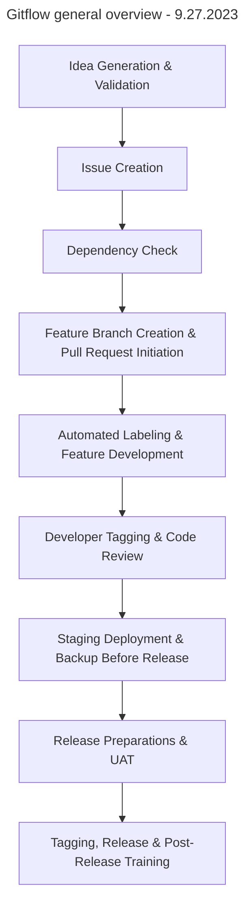

### **Idea Generation & Validation**:

- **What**:
  - Ideas for new features, enhancements, or fixes are initially drafted on a
    project board. These ideas then undergo validation involving feasibility
    checks, market analysis, or user feedback.
- **Why**:
  - **Visualization**: Provides a visual representation of the development
    pipeline.
  - **Collaboration**: Enables team discussion, prioritization, and refinement.
  - **Feasibility**: Ensures technical implementability.
  - **Value Proposition**: Validates alignment with product and company goals.

---

### **Issue Creation**:

- **What**:
  - Once the idea is fully fleshed out, including design and other necessary
    details, it's converted into an issue.
- **Why**:
  - **Documentation**: Issues provide a detailed description of the task,
    ensuring everyone understands the requirements.
  - **Tracking**: Issues can be assigned, labeled, and tracked, ensuring
    accountability and progress monitoring.

---

### **Dependency Check**:

- **What**:
  - Before starting development, check if the feature or fix has any
    dependencies, like third-party libraries or other features that need to be
    developed first.
- **Why**:
  - **Smooth Development**: Ensures that all required tools and features are
    available before starting the development.
  - **Efficiency**: Reduces the chances of development halts due to missing
    dependencies.

---

### **Feature Branch Creation & Pull Request Initiation**:

- **What**:
  - A new branch is created for each issue, ensuring isolated development. Each
    feature or fix has its own branch. A pull request (PR) is opened once a
    branch is created. Tests run automatically when a PR is made or updated.
- **Why**:
  - **Isolation**: Allows focused development.
  - **Traceability**: Links code changes to tasks.
  - **Stability**: Keeps the main branch deployable.
  - **Parallel Development**: Enables simultaneous feature development.
  - **Early Feedback**: Provides continuous feedback.
  - **Integration**: Ensures smooth code integration.
  - **Quality Assurance**: Verifies no new bugs are introduced.
  - **Immediate Feedback**: Notifies developers of test results.

---

### **Automated Labeling & Feature Development**:

- **What**:
  - An automated label "ready to code" is added to the issue. Developers then
    begin coding, periodically reviewing and refactoring the codebase. Code is
    documented and commented, including inline comments and README updates.
- **Why**:
  - **Status Indication**: Provides a visual status update.
  - **Automation**: Streamlines the process.
  - **Implementation**: Transforms ideas into functional software.
  - **Progress**: Advances the development process.
  - **Clarity**: Assists other developers.
  - **Maintainability**: Facilitates future changes and ensures easy future
    updates.
  - **Code Quality**: Enhances code efficiency.

---

### **Developer Tagging & Code Review**:

- **What**:
  - Developers tag PRs for review when they're ready. PRs are then reviewed by
    one or more team members before merging.
- **Why**:
  - **Communication**: Notifies code reviewers.
  - **Efficiency**: Streamlines the review process.
  - **Knowledge Sharing**: Familiarizes the team with changes.
  - **Mentoring**: Helps junior developers learn.
  - **Error Detection**: Increases the chance of spotting mistakes.

---

### **Staging Deployment & Backup Before Release**:

- **What**:
  - Changes are deployed to a staging environment after merging. A recent backup
    of critical data is ensured before deployment.
- **Why**:
  - **Final Validation**: Allows real-world testing.
  - **Bug Detection**: Identifies last-minute issues.
  - **Safety Net**: Provides a recovery point.
  - **Data Integrity**: Ensures data restoration if needed.

---

### **Release Preparations & UAT**:

- **What**:
  - A release branch is created as a release approaches. Selected end-users test
    new features before release.
- **Why**:
  - **Focus**: Enables focus on final testing and documentation.
  - **Stability**: Ensures a thoroughly tested release.
  - **Validation**: Confirms changes meet user expectations.
  - **Quality**: Minimizes post-release issues.

---

### **Tagging, Release & Post-Release Training**:

- **What**:
  - The release-ready commit is tagged, and a GitHub release is created.
    Training is provided if significant changes or new features are introduced.
- **Why**:
  - **Versioning**: Provides clear version history.
  - **Documentation**: Offers release notes for users.
  - **Adoption**: Ensures effective user adoption.
  - **Support**: Reduces support queries.
